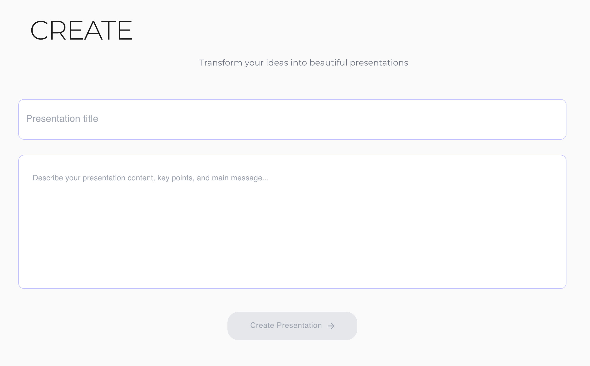
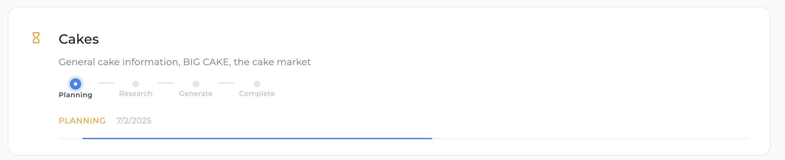
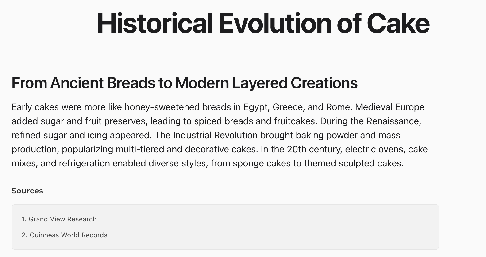
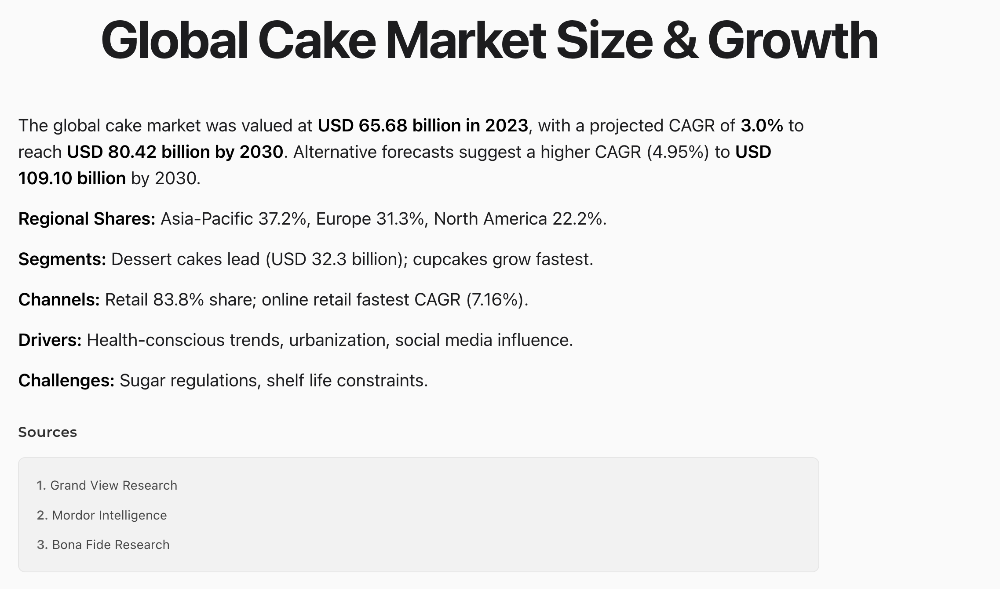

# Presentation Generator

A minimalist presentation generator and viewer that creates beautiful, modern presentations from simple text descriptions using OpenAI's language models.

## Overview

This project uses AI to automatically generate professional presentations from a title and description. It employs a sophisticated multi-stage process:

1. **Planning Stage**: Uses o4-mini (a compact reasoning model with image support) to analyze requirements and plan content structure
2. **Research Stage**: 
   - Uses gpt-4o-mini-search-preview to search the internet for current/factual information
   - Uses gpt-4.1-nano (ultra-compact general purpose model) to generate content from general knowledge
3. **Generation Stage**: Uses o4-mini to create the final presentation with multiple slide types

The system is designed with resilience in mind, featuring retry logic for API calls and comprehensive error handling to ensure reliable generation even when facing API limitations.

## Project Structure

This project consists of two main parts:

1. **PHP Generator**: A PHP backend that orchestrates the AI models to generate presentation slides.
2. **Web Viewer**: A React application to view and present the generated presentations.

## How It Works

### 1. Content Planning

The system first uses o4-mini (reasoning model) to create a detailed content plan:
- Analyzes the presentation title and description
- Determines key themes and topics
- Identifies which topics need factual research vs. general knowledge
- Suggests appropriate slide types for each content section
- Prioritizes content items

### 2. Content Research

For each topic in the plan:
- **Web Search**: If factual/current information is required, uses gpt-4o-mini-search-preview to research the topic and cite sources
- **Knowledge Generation**: For conceptual/general topics, uses gpt-4.1-nano to generate content using its existing knowledge

### 3. Presentation Generation

Once all content is researched:
- Uses o4-mini to structure the final presentation
- Creates 6-10 slides with appropriate content distribution
- Formats each slide according to its type (title, bullet, text, etc.)
- Includes source citations where applicable

### 4. Output Format

The presentation is generated as a JSON structure with various slide types:
- **Title slides**: For presentation title and introduction
- **Bullet slides**: For concise, structured information
- **Text slides**: For detailed explanations with rich markdown formatting
- **Image slides**: For visual content with captions
- **Code slides**: For displaying code examples
- **Quote slides**: For featuring notable quotes
- **Split slides**: For showing two columns of content
- **Comparison slides**: For comparing items side by side

## Setup

### PHP Generator Setup

1. Navigate to the PHP directory:
   ```
   cd php
   ```

2. Install dependencies with Composer:
   ```
   composer install
   ```

3. Set up your OpenAI API key:
   - Create a file `php/config/openai.txt`
   - Paste your OpenAI API key into this file (just the key, no additional content)

### Web Viewer Setup

1. Navigate to the web directory:
   ```
   cd web
   ```

2. Install dependencies:
   ```
   npm install
   ```

3. Start the development server:
   ```
   npm run dev
   ```

## Usage

### Generating a Presentation

You can generate a presentation in two ways:

#### Interactive Mode

Run the generator script without arguments to use interactive mode:

```
php generate.php
```

You will be prompted to enter:
- A presentation title
- A description of the content you want in the presentation

Alternatively, use the web interface by navigating to the application in your browser, where you'll see the creation form.

#### Command Line Arguments

```
php generate.php "Your Presentation Title" "Detailed description of what you want in your presentation" [output_filename.json]
```

The output filename is optional. If not provided, a filename will be generated based on the title.

### Generation Process

The system will process your request through several stages:

1. **Planning**: Analyzing requirements and creating a content structure (~10-15 seconds)
2. **Research**: Gathering information for each topic (varies based on content plan)
   - Web search items take longer due to external API calls
   - Knowledge-based items are typically faster
3. **Generate**: Creating the final presentation structure and slides (~15-20 seconds)
4. **Complete**: Final validation and optimization of the presentation data

Throughout the process, you'll see progress updates and information about which topics are being researched.

### Viewing a Presentation

1. Start the web viewer:
   ```
   cd web
   npm run dev
   ```

2. Use one of the following methods to view your presentation:

   - **Upload file**: Click the "Upload Presentation JSON" button and select your generated JSON file.
   
   - **URL parameter**: Open the viewer with a URL like:
     ```
     http://localhost:3000?file=path/to/your/presentation.json
     ```

## Advanced Features

### API Cost Tracking

The system tracks token usage and calculates approximate costs for each API call:
- Input tokens (prompts sent to the API)
- Output tokens (responses from the API)
- Total estimated cost based on OpenAI's pricing

### Resilient API Calling

The system includes sophisticated retry logic:
- Configurable maximum retry attempts
- Exponential backoff for rate limits
- Smart error classification to determine if errors are retryable
- Detailed logging of API interaction

### Content Quality Optimizations

Several mechanisms ensure high-quality output:
- Source tracking for research-based content
- JSON validation and cleaning to prevent formatting errors
- Markdown formatting for rich text presentation

## Example

1. Generate a presentation:
   ```
   php generate.php "Introduction to AI" "Create a presentation about artificial intelligence. Cover the history of AI, different types of AI (narrow vs general), machine learning basics, neural networks, and future trends. Include some real-world applications and recent breakthroughs."
   ```

2. View the presentation in the web viewer.

## Customization

You can adjust various parameters in the generator and viewer to customize the experience:

- Modify `php/src/PresentationService.php` to change:
  - Which AI models are used for different stages
  - Retry configuration for API calls
  - Content planning and generation prompts
  
- Edit the React components in the `web/src/presenter` directory to change:
  - The appearance of different slide types
  - Presentation controls and behavior
  - Viewer interface elements

## Screenshots

### Creation Interface


### Planning View


### Sample Presentation Slides


